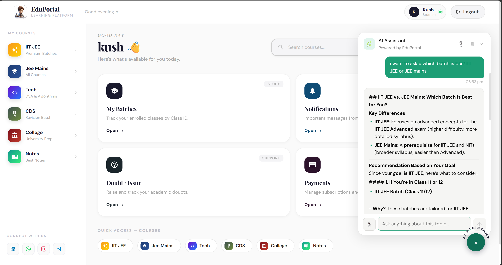
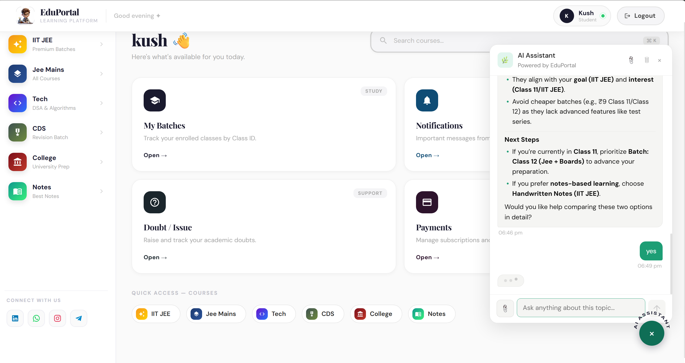
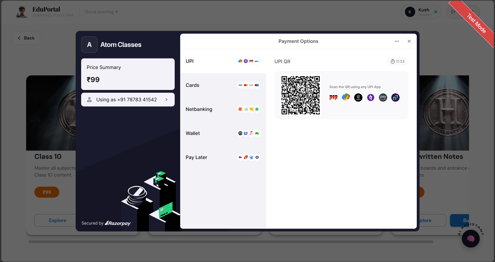
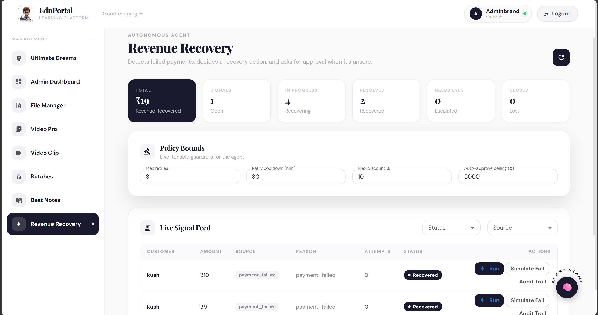
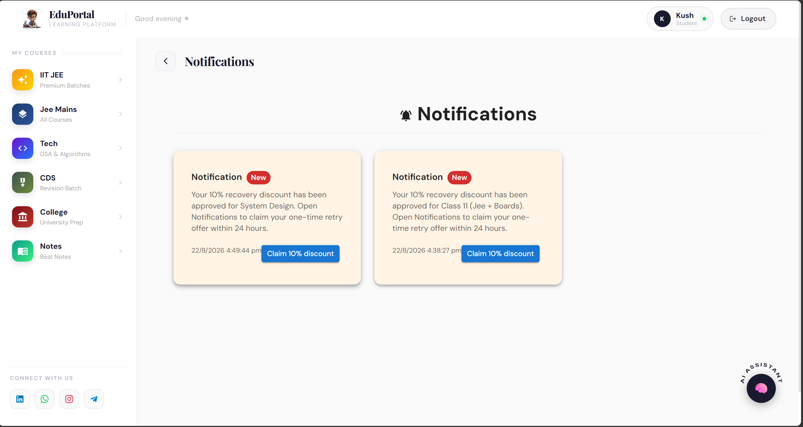

# EduPortal AI — Agentic Learning & Revenue Recovery Platform

An AI-powered edtech platform that helps students discover the right course, learn with a personalised assistant, make secure payments, and receive guided recovery support when a payment fails.

Built for the **Razorpay Buildathon — AI Revenue Recovery Track**.

## Problem

Students may leave a purchase unfinished because of a payment failure, checkout interruption, or uncertainty about the right course. Merchants lose revenue while students lose learning momentum.

EduPortal AI closes this gap with goal-based course guidance, secure Razorpay checkout, live failed-payment detection, admin-approved recovery offers, student notifications, retry links, and an assistant that understands the currently logged-in student's courses, interests, payments, and recovery status.

## Core Solution

```text
Student
  ↓
AI Course Guidance + Secure Checkout
  ↓
Razorpay Test Mode Payment
  ↓
Payment Success / Payment Failure
  ↓
Revenue Recovery Signal
  ↓
Admin Approval + Bounded Discount Offer
  ↓
Student Notification + Retry Checkout
  ↓
Verified Payment + Course Access
```

## Key Features

### AI Study & Commerce Assistant

- Answers study questions using course material and notes.
- Helps students decide between PCM and PCB using interests, strengths, and goals.
- Understands goals such as IIT JEE, JEE Main, NEET, DSA, and web development.
- Recommends live batches and note batches from MongoDB.
- Compares batches using real exam focus, audience, curriculum, and included features.
- Knows batches owned by the authenticated student.
- Gives current payment and recovery status for that student only.
- Keeps chat during the active login session; a new login starts a fresh conversation.

### Batch Intelligence

Every batch can store:

- Exam focus
- Target audience
- Learning outcomes
- Included features
- Price and availability

For example, the platform differentiates IIT JEE preparation (JEE Main + Advanced, PYQs, test series, mentorship, doubt support) from JEE Main-focused preparation (Main PYQs, practice, mocks, and performance analysis). Admin-entered batch data overrides category defaults.

### Secure Razorpay Checkout

- Backend creates Razorpay orders from database prices.
- Razorpay payment signatures are verified server-side.
- Course access is granted only after verification.
- Free batches use direct enrolment.
- Payment attempts are saved for support and recovery.
- Razorpay Test Mode supports a safe end-to-end demo.

### AI Revenue Recovery

- Detects failed-payment signals.
- Shows customer, amount, source, reason, attempts, and status in the admin dashboard.
- Tracks open, recovering, recovered, escalated, and closed cases.
- Provides policy controls for retries, cooldown, discount cap, and approval threshold.
- Maintains an audit trail for agent decisions and actions.
- Uses a responsive mobile signal feed while preserving the desktop dashboard layout.

### Admin-Controlled Recovery Offers

1. A payment fails and creates a recovery signal.
2. The signal appears in the Revenue Recovery dashboard.
3. The admin approves a time-limited discount offer.
4. The student sees a login popup and notification.
5. The student claims a secure discounted retry checkout.
6. A verified retry marks the recovery case as recovered.

Every failed-payment offer requires explicit admin approval. The platform never automatically charges a student, grants access without verified payment, or promises a refund.

## Architecture

```text
React Frontend
      ↓
Express REST APIs
      ↓
MongoDB Database
      ↓
AI Assistant Context Engine
      ↓
Razorpay Test Mode
      ↓
Revenue Recovery Agent
      ↓
Admin Dashboard + Student Notifications
```

## Tech Stack

**Frontend:** React, Material UI, React Router, Axios, Socket.IO Client  
**Backend:** Node.js, Express.js, MongoDB, Mongoose, JWT, Razorpay SDK, Socket.IO, Upstash Redis, AI/LLM integration

## Security and Reliability

- JWT-based authentication and protected admin routes
- Server-side price validation and Razorpay signature verification
- User-specific purchase, payment, and chatbot context
- Admin approval before recovery discounts
- Duplicate failed-payment protection
- Recovery audit trail
- No sensitive token logging

## Local Setup

### 1. Install backend dependencies

```bash
cd back
npm install
```

### 2. Configure `back/.env`

```env
PORT=5000
MONGO_URI=your_mongodb_connection_string
JWT_SECRET=your_secure_jwt_secret

RAZORPAY_KEY_ID=your_razorpay_test_key_id
RAZORPAY_SECRET=your_razorpay_test_key_secret

OPENAI_API_KEY=your_ai_key
UPSTASH_REDIS_REST_URL=your_redis_url
UPSTASH_REDIS_REST_TOKEN=your_redis_token
```

Never commit real `.env` credentials to GitHub. Use `.env.example` in a public repository.

### 3. Start backend

```bash
npm run dev
```

### 4. Install and start frontend

```bash
cd ../dash
npm install
npm start
```

Backend: `http://localhost:5000`  
Frontend: `http://localhost:3000`

## Recommended Buildathon Demo

1. Student logs in and tells the AI assistant a learning goal.
2. The assistant compares IIT JEE and JEE Main batches with live batch data.
3. Student starts Razorpay Test Mode checkout.
4. A payment failure creates a Revenue Recovery signal.
5. Admin reviews and approves a recovery discount, run, simulate fail, audit trial.
6. Student receives a popup and notification.
7. Student asks the chatbot about payment status and receives live recovery information.
8. Student claims the discount, retries checkout, and receives verified course access.

## Buildathon Fit

### Primary Track: AI Revenue Recovery

The project detects failed payments, creates a bounded recovery workflow, requires human approval for discount offers, provides student communication, and records each decision in an audit trail.

### Additional Strength: AI Growth & Agentic Commerce

The assistant recommends suitable live courses, compares batches using real data, understands student goals, and guides students toward safe checkout actions.

## Future Improvements

- WhatsApp and email recovery reminders
- Public-deployment Razorpay webhooks
- Recovery conversion analytics
- Hinglish support
- Subscription and mandate-retry recovery
- Role-based administrative permissions

## Author

Built for the Razorpay Buildathon as an AI-powered learning and revenue-recovery platform.


## Screenshots

### AI Course Guidance



### IIT JEE vs JEE Main Comparison



### Razorpay Test Checkout



### AI Revenue Recovery Dashboard



### Student Recovery Notification


